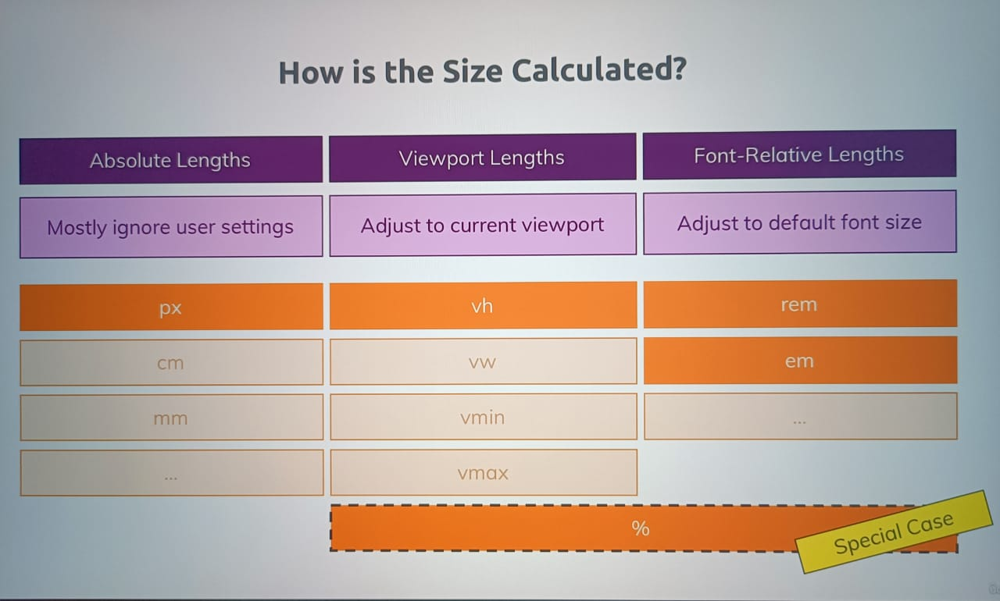

# Dimensions, Units and Sizes

## Units

1. When we give font size in px, if user increases font size in browser font size in our website will not increase.
2. So adding font size in px is not good idea, as wensite is not dynamic with this unit.
3. There are different units in css:
   | Name | Unit |
   | -------------- | ------------- |
   | pixels | px |
   | percentage | % |
   | root em | rem |
   | em | em |
   | viewport height| vh |
   | viewport width | vw |
4. Properties for which we can use units:
   1. font-size
   2. margin
   3. padding
   4. border
   5. width
   6. height
   7. top
   8. bottom
   9. left
   10. right
   11. border-radius

## How is size calculated?

