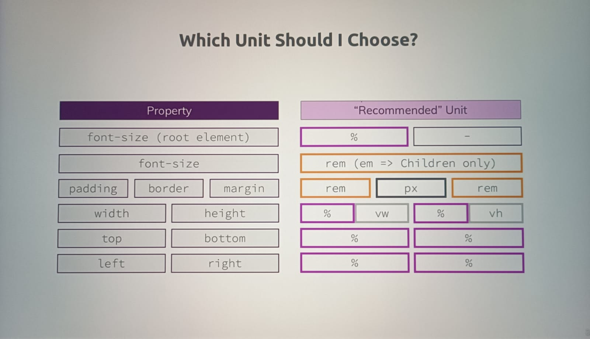

# Dimensions, Units and Sizes

## Units

1. When we give font size in px, if user increases font size in browser font size in our website will not increase.
2. So adding font size in px is not good idea, as wensite is not dynamic with this unit.
3. There are different units in css:
   | Name | Unit |
   | -------------- | ------------- |
   | pixels | px |
   | percentage | % |
   | root em | rem |
   | em | em |
   | viewport height| vh |
   | viewport width | vw |
4. Properties for which we can use units:
   1. font-size
   2. margin
   3. padding
   4. border
   5. width
   6. height
   7. top
   8. bottom
   9. left
   10. right
   11. border-radius

## How is size calculated?

## % (percentage)

1. When we give an element height or width etc in %, it's value is dependent on another element.
2. Such element refer to different element, based on its position type.

### % in fixed position:

1. When we apply **_position: fixed;_** to an element, then its containing block is viewport.
2. So if we give such element 100% width, element will occupy 100% of width of viewport.

### % in absolute position:

1. When we apply **_position: absolute;_** to an element, then its containing block is first non-static parent or ancestor.
2. Important thing to remember is element with absolute position, when given width in %, will refer to **_ancestor's content + padding._**
3. So supposingly, width of parent of absolute element is 200px, and it has padding of 4px. If we apply width to absolute element 100%, its width will become exactly 200px.(Consider parent is non-static)
4. In this case, child will ignore that its parent has padding.

### % in relative and static position:

1. When we apply **_position: relative;_** or **_position: static;_** to an element, then for %, it will refer to its first block level ancestor.
2. But in this case, unlike absolute, relative or static element will refer to content of its block-level parent.
3. So, such element will respect padding of its parent.
4. Supposing we have element with reative position. Its parent is block element with 200px width and 10px padding. And if apply width: 100% to child(relative element), then width of child will be 80px as it will respect its parent's padding of 10% on left and right.

## rem and em

1. rem and em are units, calculated based on font size.
2. In chrome, 1em = 16px
3. To check what is 1em equal to, apply font-size to an element 1em, then check computed value in developers tool.

### em:

1. Issue we face with em is, it does not always refer to font size of html tag or root tag. It refers to its parent's font size.
2. If parent has font size in px, then we don't face much issue but if parent also has value in em, it will refer to parent's font size, which is error prone.
3. We need unit where we always refer to a fixed value or font size of root element only.

### rem:

1. rem is the unit which resolve issue we face during em.
2. rem will always refer to font size of root element so its most reliable.
3. Always rem over em. But if we want to use em, we can use it in child element which does not have any child.(leaf element in tree structure.)
4. We can apply rem to other properties as well apart from font-size. e.g. (margin, padding)
5. Do prefer rem for margin and padding. Just be sure if page whole structure doesn't collapse when font-size is increased in browser setting.

### vh and vw

1. vh, vw as name suggest refers to height and width of viewport.
2. Generally used to assign height and width to backdrop of 100% height and width.
3. 10vh means 10% of viewport height.
4. There are two more units vmin and vmax. (10vmin means 10% of smaller viewport)

#### Hiding Scrollbars on Windows machines

After adding vw , you probably saw that the scrollbars appeared in case you are working on Windows. This happens as using vw on Windows does not include the scrollbars - vw: 100 is equal to 100% of the viewport width + the scrollbars. On the Mac this is not an issue, but when using Windows it is as the scrollbars are displayed by default.

In case you don't want to display these scrollbars, you can use one of these solutions:

- Use width: 100% instead of vw: 100

- Add overflow-x: hidden; to the body selector in the shared.css file to hide the horizontal scrollbar (or overflow-y: hidden to hide the vertical scrollbar)

Alternatively you could also use the ::-webkit-scrollbar pseudo element. Simply add the following code to the shared.css file:

body: :-webkit-scrollbar {
width: 0
}
To make sure this works correctly on different browsers, you have to add additional code to it. This blog post nicely summarizes all the code needed right here.

Make sure to follow these approaches in case you don't want to display the scrollbars on Windows machines.

## Which unit should we use?

In general go for following approach.

