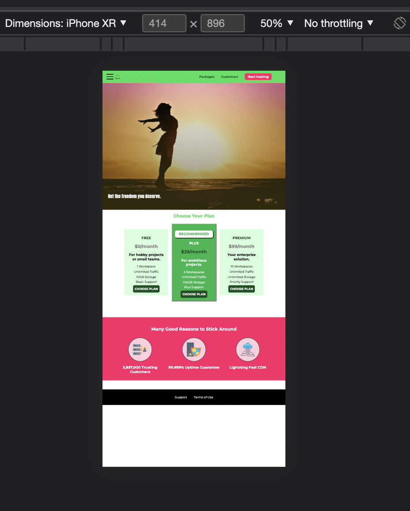

# Making a Website Responsive

## Software vs Hardware pixels:

1. Browser cannot tell difference between a desktop device and mobile device.
2. This is how our website will look like on a mobile device.
3. 
4. The browse basically squeezes the entire site into mobile device.
5. If we see, 1 inch = 96 px. And the pixel density on mobile and desktop are different.
6. This leads to point no. 3.(Website gets squeezed in mobile view)
7. Refer https://www.mydevice.io/ to get pixel density and ratio of different devices.

## viewport Metatag vs media query:

1. 'viewport metatag' is required to adjust our site to mobile device viewport.
2. We need to consider mobile device width to do this. Viewport metatag does not make any design changes, it just make our site adjust to other devices(as we seen different devices have different pixel density.)
3. Media queries on the other hand makes changes in design according to width and height.
4. We can specify whether use can zoom in or out in mobile devices in viewport metatag. Generally we give user flexibility to zoom in and out.
5. We can also specify how much a user can zoom in or out with help of 'maximum-scale=2.0' and 'minimum-scale=1.2'.
6. Without viewport metatag, we cannot create a mobile design for our website.
7. If we don't want out website to have any mobile device design, then not using viewport tag is best.
8. Nowadays websites are made with mobile first approach. i.e. Mobile view is first developed and then desktop view.
