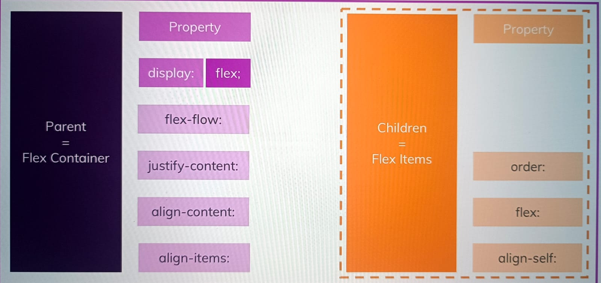

# Flexbox

1. To use flexbox, we need to apply

```
display: flex;
```

property to container.

2. This will convert that container into flex container
3. Children of this flex container will become flex items.

## Understanding Flexbox



## Creating a flex container

1. When we apply display: flex; to container, all its children will become flex-items
2. First thing that will happen when we apply display: flex; width-wise is all flex-items will take minimum space width-wise.
3. If we increase width of screen the width of container increases(If width od container is not specified.)
4. If we decrease width of screen, the width of flex item will also shrink, but it shrinks until the content of that flex item.
5. Height of container will be equal to height of flex item with maximum height;
6. All other flex item will get height equal to height of flex item with maximum height(If their height is not specified already)

## Flex-direction

1. Default value of flex direction is row, in which main axis is horizontal and cross axis is vertical
2. In case of flex direction horizontal, default width will be maximum required for content inside and default height will be height of maximum height element of height of container.
3. If we apply flex direction: column; main axis will become vertical from top to bottom and cross axis will become horizontal from left to right.
4. In this case, default height will be minimum only required for content and default width will be maximum of width of container.

## flex-wrap

1. Default value of flex-wrap: nowrap;
2. In this case elements will take width required by it and will not get wrapped when screen width is minimized.
3. If we apply **flex-wrap: wrap;**, when we reduce screen size, the last element will go to below row and take default minimum height if height is not assigned to it explixitaly.
4. If we keep reducing screen size, second last element will get new row. and default height will be height of element with maximum height among two element in second row
5. If we apply, **flex-wrap: wrap-reverse;**, wrapping will happen in reverse order.
6. i.e. instead of last element going to second line, it will go to fist line and rest elements will go to second line.
7. Height of last element in first row, will behave similarly as in height in **flex-wrap: wrap;**
